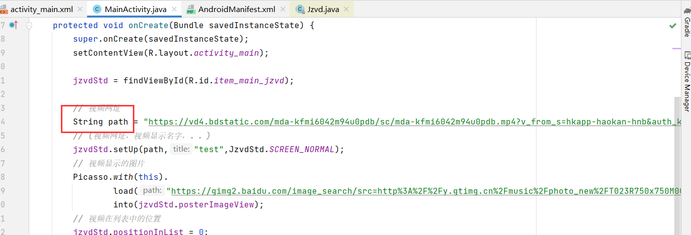
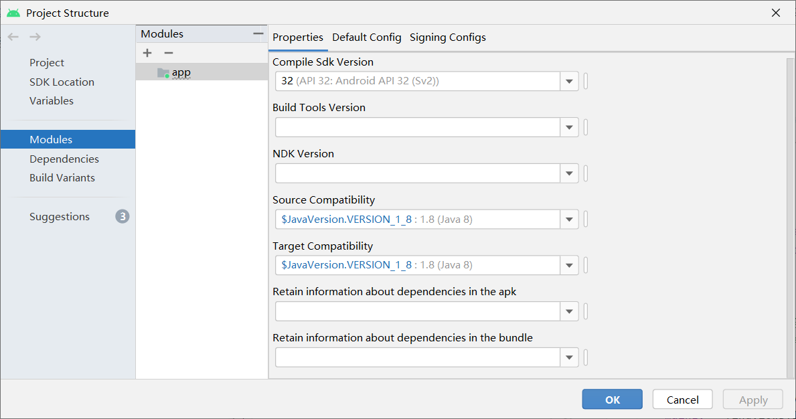
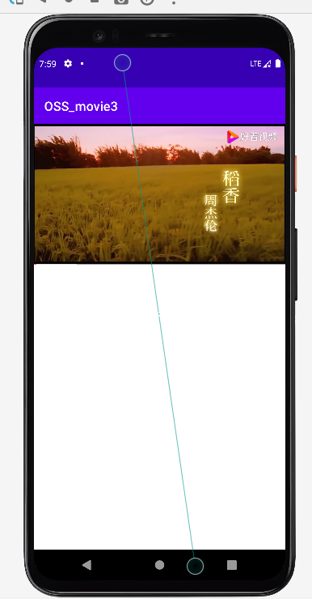

# movie_android
安卓网络视频播放器

本项目借鉴了GitHub中：https://github.com/Jzvd/JZVideo
本项目详细的制作过程，可以查看我的博客：http://t.csdn.cn/1XIjr
(**如果你使用git下载总是报红**，你可以选择下载dev-sidecar编程软件加速下载--https://gitee.com/interesting-goods/dev-sidecar?_from=gitee_search)

## 1.本项目的特色

​		1.在借鉴的项目上提取了网络视频播放的部分代码，使大家可以快速的弄出这一部分的功能。

​		2.只需要在项目MainActivity.java中，修改网络地址即可实现播放自己的功能

## 2.本项目开放环境：

## 3.项目的功能展示

相应的安卓apk（网络视频播放器.apk---链接：https://pan.baidu.com/s/1QVmd0Aa75913PcpAIwnQfg 提取码：x3u7），大家可以下载使用以下

